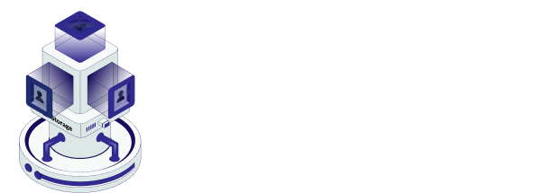

<!--
*** Thanks for checking out the Best-README-Template. If you have a suggestion
*** that would make this better, please fork the repo and create a pull request
*** or simply open an issue with the tag "enhancement".
*** Don't forget to give the project a star!
*** Thanks again! Now go create something AMAZING! :D
-->

<!-- PROJECT SHIELDS -->
<!--
*** I'm using markdown "reference style" links for readability.
*** Reference links are enclosed in brackets [ ] instead of parentheses ( ).
*** See the bottom of this document for the declaration of the reference variables
*** for contributors-url, forks-url, etc. This is an optional, concise syntax you may use.
*** https://www.markdownguide.org/basic-syntax/#reference-style-links
-->

<!-- [![Contributors][contributors-shield]][contributors-url]
[![Forks][forks-shield]][forks-url]
[![Stargazers][stars-shield]][stars-url]
[![Issues][issues-shield]][issues-url]
[![MIT License][license-shield]][license-url]
[![LinkedIn][linkedin-shield]][linkedin-url] -->

<!-- PROJECT LOGO -->
<br />
<div align="center">
<h3> ETHForALL Winning Project </h3>
  <a href="https://github.com/lordshashank/Eastore">
    
  </a>

<h2 align="center">Eastore</h2>

  <p align="center">
   Easing your Filecoin storages
    <br />
    <a href="https://devfolio.co/projects/eastore-e336"><strong>Explore the Project »</strong></a>
    <br />
    <br />
    <!-- to edit -->
    <a href="https://youtu.be/63_99bHQNsg">View Demo</a> 
    ·
    <a href="https://github.com/lordshashank/Eastore/issues">Report Bug</a>
    ·
    <a href="https://github.com/lordshashank/Eastore/issues">Request Feature</a>
  </p>
</div>

<!-- TABLE OF CONTENTS -->
<details>
  <summary>Table of Contents</summary>
  <ol>
    <li>
      <a href="#about-the-project">About The Project</a>
      <ul>
        <li><a href="#built-with">Built With</a></li>
      </ul>
    </li>
<!--     <li> -->
<!--       <a href="#getting-started">Getting Started</a>
      <ul>
        <li><a href="#prerequisites">Prerequisites</a></li>
        <li><a href="#installation">Installation</a></li>
      </ul> -->
<!--     </li> -->
    <li><a href="#usage">Usage</a></li>
    <li><a href="#contributing">Contributing</a></li>
    <li><a href="#contact">Contact</a></li>
    <li><a href="#acknowledgments">Acknowledgments</a></li>
  </ol>
</details>

<!-- ABOUT THE PROJECT -->

## About The Project

Eastore, a decentralized storage marketplace and full-sector bounty rewarder. Bringing filecoin deals to your fingertips through Eastore. This is made using Filecoin Virtual machine and uses its miners to store and retrieve data, completely decentralized. You can view our project in depth at devfolio.

Team - `surfer05` `lordshashank` `1010adigupta` `me-loser`

<p align="right">(<a href="#readme-top">back to top</a>)</p>

### Built With

- [next-url]
- [react-url]
- [filecoin-url]
- [lotus-url]

<p align="right">(<a href="#readme-top">back to top</a>)</p>

<!-- GETTING STARTED -->

## Getting Started

So as to run our project locally, you need to follow the steps below.

### Prerequisites

First of all you need to havee a lotus node running on your system. You can follow the steps given at [https://docs.filecoin.io/developers/infrastructure/how-tos/spin-up-a-lite-node/] to do so.

Then you have to get authentication token which you have to put in .env file in the backend directory of this repo.

### Installation

1. Get a free Moralis API Key at [https://moralis.io](https://moralis.io)
2. Clone the repo
   ```sh
   git clone https://github.com/lordshashank/Eastore
   ```
3. Install NPM packages on both backend and frontend folders
   ```sh
   npm install
   ```
4. Enter your API in `.env` of frontend directory
   ```sh
   MORALIS_API_KEY= "your api key"
   APP_DOMAIN=authetication.sha
   NEXTAUTH_URL=http://localhost:3000
   NEXTAUTH_SECRET= "your secret"
   ```
5. similarly get Lotus authentication token and put it in .env file in backend directory
6. Run the project in frontend using
   ```sh
   npm run dev
   ```
7. Run the project in backend using
   ```sh
   npx nodemon app.js
   ```
8. You can now view the project at `http://localhost:3000`

Also we have made a directory for smart contracts deployed by us using FEVM hardhat kit at [https://docs.filecoin.io/developers/smart-contracts/hardhat/]. we just have added one contract in it which is [https://github.com/lordshashank/Eastore/blob/master/contracts/contracts/cashback.sol] which is used to give cashback to the users who have bought full sectors on FVM.

<p align="right">(<a href="#readme-top">back to top</a>)</p>

<!-- USAGE EXAMPLES -->

## Usage

We didn't find any storage marketplace for newly made hyperspace network, and user had to interact with lotus CLI to get a nominal deal-id to work on. Thus, we tended to solve this problem. <br/>

This was just beginning, we then realised that file storage system is quite unorganised in FVM, thus started thinking of ideas to make it easy and profitable for both users and miners. First, we built a minimal storage interaction system that interacts with FVM storage providers to store and retrieve user data easily. We created an interactive frontend to give users a smooth experience of storing and retrieving there data. <br/>

It is difficult for the users to find just the right deal on filecoin ecosystem. There are issues related to storage size or lifetime or storage and many more. `Eastore` helps you get the deals as per your requirement through the extensive filters our site provides. It also helps you get great rewards for your deals. <br/>

Then, we thought that all users might not have FIL tokens to work with. Thus we integrated many chains into our dapp, now, user can pay in with eth, avax, etc in to get a deal on the filecoin network. This reduces customer's friction and increases market manifolds. Although, we provided additional benefits for users using the FIL token so as to incentivize people to join the network. <br/>

Afterwards, we came to know about sectors in FVM. We understood that completely filled sectors were quite beneficial for storage providers and the filecoin network. Sectors being sealed by filling trash data fills trash in filecoin network and is also space wastage for storage providers. Thus, we introduced discount features in deals. If users completely fill the sector with their data, they will be provided cashback of certain amount. This way network's utility can be pivoted. <br/>

Moreover, in future we aim to include feature where users can put there files along with other users until the total aggregate fills the complete sector, and then the deal is published on chain. We also aim to put off-chain miner interactions in our dapp.

For more examples, please refer to the [Documentation](https://devfolio.co/projects/eastore-e336)

<p align="right">(<a href="#readme-top">back to top</a>)</p>

<!-- CONTRIBUTING -->

## Contributing

Contributions are what make the open source community such an amazing place to learn, inspire, and create. Any contributions you make are greatly appreciated.

If you have a suggestion that would make this better, please fork the repo and create a pull request. You can also simply open an issue with the tag "enhancement".
Don't forget to give the project a star! Thanks again!

1. Fork the Project
2. Create your Feature Branch (`git checkout -b feature/AmazingFeature`)
3. Commit your Changes (`git commit -m 'Add some AmazingFeature'`)
4. Push to the Branch (`git push origin feature/AmazingFeature`)
5. Open a Pull Request

<p align="right">(<a href="#readme-top">back to top</a>)</p>

<!-- CONTACT -->

## Contact

Eastore - [@lordshashank](https://twitter.com/urshashankt)

Project Link: [https://github.com/lordshashank/Eastore](https://github.com/lordshashank/Eastore)

<p align="right">(<a href="#readme-top">back to top</a>)</p>

<!-- ACKNOWLEDGMENTS -->

## Acknowledgments

Use this space to list resources you find helpful and would like to give credit to. I've included a few of my favorites to kick things off!

- [GitHub Cheat Sheet](https://github.com/filecoin-project/community/discussions/585)
- [FVM Docs](https://docs.filecoin.io/fvm/)
- [Filecoin specs](http://spec.filecoin.io/)
- [Zondax Github](https://github.com/Zondax/filecoin-solidity)
- [GitHub Pages](https://pages.github.com)
- [Font Awesome](https://fontawesome.com)
- [React Icons](https://react-icons.github.io/react-icons/search)

* []() The ETHForAll team was of great support to us and provided relevant information throughout this fornight long hackathon
* []() Our doubts were aptly solved, but the discord server could have been a bit more active to our doubts.
* []() Finally, kudos to the team for the great work `surfer05` `lordshashank` `1010adigupta` `me-loser`
<p align="right">(<a href="#readme-top">back to top</a>)</p>

<!-- MARKDOWN LINKS & IMAGES -->
<!-- https://www.markdownguide.org/basic-syntax/#reference-style-links -->

[next.js]: https://img.shields.io/badge/next.js-000000?style=for-the-badge&logo=nextdotjs&logoColor=white
[next-url]: https://nextjs.org/
[react.js]: https://img.shields.io/badge/React-20232A?style=for-the-badge&logo=react&logoColor=61DAFB
[react-url]: https://reactjs.org/
[filecoin-url]: https://filecoin.io/
[lotus-url]: https://lotus.filecoin.io/
